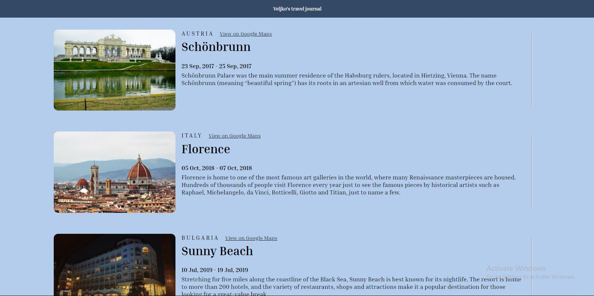
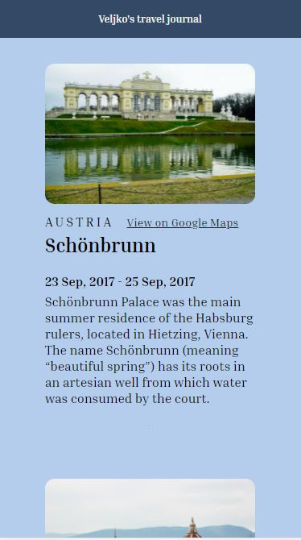

# My personalized Travel Journal

React made Travel Journal, which displays five most beautiful places I have visited. It consists of five Card components, which take hard-coded data I found on the internet from the data.js file, and display a card-like description of that place. One of solo projects on [Frontend Career Path](https://scrimba.com/learn/frontend). 

## Table of contents

- [Overview](#overview)
  - [Screenshot](#screenshot)
  - [Links](#links)
- [Process](#process)
  - [Built with](#built-with)
- [Author](#author)

## Overview

Users should be able to:
- view all the places I visited, including the exact date I visited them
- read a short Wikipedia description about every place
- view every place on Google Maps via link above

### Screenshot

Desktop and mobile design of Travel Journal.

### Links

- Live Site URL: [Travel Journal](https://https://jelenkoo10.github.io/travel_journal/)

## Process

### Built with

- Semantic HTML5 markup
- Flexbox
- [React](https://reactjs.org/) - JS library

## Author

- GitHub - [https://github.com/jelenkoo10](https://github.com/jelenkoo10)
- Frontend Mentor - [@jelenkoo10](https://www.frontendmentor.io/profile/jelenkoo10)
